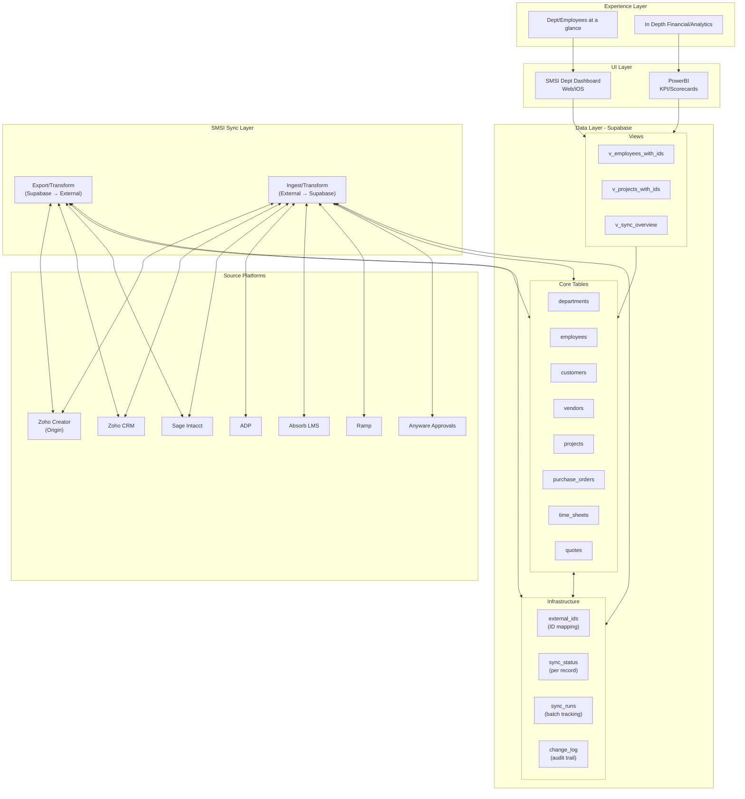

## Key Design Decisions

### 1. External ID Mapping (`external_ids` table)
- **Problem**: Same employee exists in Creator, CRM, Intacct, and ADP with different IDs
- **Solution**: Single table maps our UUID to all external IDs
- **Flexibility**: Add new systems without schema changes

```sql
-- Example: Find employee across all systems
SELECT * FROM external_ids 
WHERE entity_type = 'employee' 
  AND internal_id = '550e8400-e29b-41d4-a716-446655440000';

-- Returns:
-- system_id | external_id
-- creator   | 12345
-- crm       | CRM-EMP-001
-- intacct   | EMP-2024-0042
-- adp       | 98765432
```

### 2. Sync State Tracking
- **`sync_status`**: Per-record sync state with each system
- **`sync_runs`**: Batch operation tracking (what ran, when, success/fail counts)
- **Hash comparison**: Detect changes without full field comparison

### 3. Change Log
- Full audit trail: who changed what, when, from which system
- Enables rollback and debugging
- Powers "what changed since last sync" queries

### 4. `raw_data` JSONB Column
- Every entity table has `raw_data JSONB`
- Stores full source record before mapping
- **Flexibility**: Fields not yet mapped are still captured
- **Recovery**: Can rebuild mapped fields from raw data

## Sync Flow Example: Employee from ADP

```
1. ADP API returns employee record
2. SMSI Sync Ingest checks external_ids for ADP ID
   - Found? → Get internal UUID
   - Not found? → Check if employee exists by other match (email, name+DOB)
     - Found? → Link existing record
     - Not found? → Create new UUID
3. Transform ADP fields → Supabase schema
4. Upsert employee record (store full ADP response in raw_data)
5. Update external_ids mapping
6. Update sync_status for ADP
7. Mark sync_status as 'pending' for Creator, CRM, Intacct
8. Log change to change_log
```

## Dashboard Query Pattern

```sql
-- Department dashboard: employees with hours this week
SELECT 
    d.name as department,
    e.first_name || ' ' || e.last_name as employee,
    SUM(ts.hours_total) as total_hours,
    e.intacct_id  -- from the view
FROM v_employees_with_ids e
JOIN departments d ON e.department_id = d.id
JOIN time_sheets ts ON ts.employee_id = e.id
WHERE ts.work_date >= date_trunc('week', current_date)
GROUP BY d.name, e.first_name, e.last_name, e.intacct_id;
```

## Sync Page UI

The `v_sync_dashboard` view powers the Sync page with one row per app:

| App | Status | Last Sync | Duration | Records | Actions |
|-----|--------|-----------|----------|---------|---------|
| Zoho Creator | ✅ Success | 5 min ago | 12s | 45 updated | [Sync Now] |
| Zoho CRM | ✅ Success | 5 min ago | 8s | 12 updated | [Sync Now] |
| Sage Intacct | ⚠️ Partial | 15 min ago | 45s | 3 failed | [Sync Now] [View Errors] |
| ADP | 🔄 Running | Started 2s ago | - | - | [Cancel] |
| Absorb LMS | ✅ Success | 1 hr ago | 3s | 0 changes | [Sync Now] |

### Triggering a Sync

```sql
-- User clicks "Sync Now" for Creator
SELECT request_sync('creator', 'both', NULL, 'brad@smsi.group');
-- Returns: UUID of the sync request

-- Sync specific entities only
SELECT request_sync('intacct', 'export', ARRAY['employee', 'project'], 'brad@smsi.group');
```

### Sync Worker Flow

Your n8n/worker picks up pending requests:

```sql
-- Get next pending sync request
SELECT * FROM sync_requests 
WHERE status = 'pending' 
ORDER BY requested_at 
LIMIT 1 FOR UPDATE SKIP LOCKED;

-- Mark as processing
UPDATE sync_requests 
SET status = 'processing', started_at = now() 
WHERE id = :request_id;

-- ... do the sync work ...

-- Update app status when done
UPDATE sync_apps SET
    last_sync_at = now(),
    last_sync_status = 'success',
    last_sync_duration_ms = :duration,
    last_records_processed = :processed,
    last_records_updated = :updated,
    last_records_failed = :failed
WHERE id = :app_id;

-- Complete the request
UPDATE sync_requests 
SET status = 'completed', completed_at = now(), sync_run_id = :run_id
WHERE id = :request_id;
```

## Soft Delete vs Hard Delete

**Soft Delete** (default):
```sql
SELECT soft_delete('employee', '550e8400-...', 'brad@smsi.group');
-- Sets is_deleted=true, deleted_at=now(), logged to change_log
-- Record still exists, excluded from normal views
-- External ID mappings preserved
```

**Restore**:
```sql
SELECT restore_deleted('employee', '550e8400-...', 'brad@smsi.group');
-- Sets is_deleted=false, logged to change_log
```

**Hard Delete** (permanent):
```sql
SELECT hard_delete('employee', '550e8400-...', 'brad@smsi.group');
-- Removes record permanently
-- Removes external_ids mappings
-- Removes sync_status entries  
-- Full record snapshot saved to change_log for forensics
```

**View Deleted Records**:
```sql
SELECT * FROM v_deleted_records ORDER BY deleted_at DESC;
```
